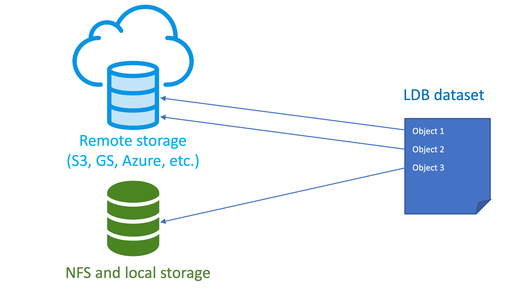

# α README

Label Database (**LDB**) is an **open-source** tool for **data-centric** AI and machine learning projects. It works **upstream from model training** and intends to index data in the *cloud storages* and *data lakes*, organizing pointers to data samples into datasets.

**LDB** aims to displace ad-hoc dataset management and de-duplication tools – such as file folders, spreadsheets and SQL databases. In the upstream direction, LDB can interface with labeling software, and in the downstream direction LDB integrates with model-based ML pipelines. 

**Key LDB features**:

*  MLOps-grade **command line** experience. 
* Lightweight management of data sources. Data objects can exist anywhere in local storage, S3, Google Cloud, or Azure. There is **no need** to **move or duplicate** data objects in order to create, share or modify a dataset (named collection of pointers).
* Advanced manipulation and versioning for datasets. Collections can be cloned, queried, merged, and sampled. **Every change in a dataset is tracked**, and provenance of constituent objects can be verified at all times.
* Label-aware operations. Objects can be selected based on **annotation metadata, file attributes, or custom ML model queries**, and changes to ingress object metadata are versioned. 
* **LDB datasets are reproducible,** **shareable, and fast to materialize**. A particular dataset version will always point to the same set of data objects and annotations. Data samples can be placed in a shared cache during instantiation, so transfers from remote locations are accelerated.

### Contents

- [Installation](#installation)
- [How LDB works](#how-ldb-works)
- [Quick start](#quick-start)
- [Comparison to related technologies](#comparison-to-related-technologies)
- [Contributing to LDB](contributing-to-LDB)

## Installation

### pip **(PyPI core)**

```sh
pip install ldb-alpha
```

### installation with ML plugins **(optional)**

```sh
pip install 'ldb-alpha[clip-plugin,resnet-plugin]' 
```

### sample dataset with curl **(optional)**
```
curl -L https://remote.ldb.ai/datasets/dogs-and-cats/dogs-and-cats.tar.gz | tar xz
```

More sample datasets [here](documentation/Datasets.md)


### How LDB works

LDB indexes immutable storage locations and notes all unique data objects along with their associated annotations (if present). This index can then be queried to construct datasets that work like collections of sparse pointers into the storage. Note that LDB does not save data objects internally, and relies on persistent storage locations to serve (instantiate) the datasets in the future (for training and examination).



The main use case for LDB is to create and maintain persistent collections of cloud-based objects. These collections (datasets) are filled by logical queries into the index or other datasets (e.g. samples annotated with a certain class, created at given time, contains a given number of event instances, etc). 

These datasets can then be shared and versioned within LDB, which makes collaboration on dataset membership state (cloning, merging, splitting, adding, and removing objects) manageable and reproducible.

Whenever a dataset needs to be instantiated (for instance, to run a model experiment), LDB copies all relevant objects from storage into the data workspace and compiles the linked annotations. Since storage is immutable and all dataset state is kept within LDB, this workspace can be safely erased after the experiment is complete.

## Quick Start
Please refer to [LDB workflow](documentation/Getting-started-with-LDB.md) for more a detailed discussion of the Data-driven AI methodology.

**LDB instance** is a persistent structure where all information about known objects, labels and datasets is being stored. A private LDB instance will be created automatically in the `~/.ldb` directory the first time an LDB dataset is created or an LDB query is run. To set up a shared LDB instance for a team or organization, please follow [LDB team setup](documentation/Quick-start-teams.md).

### Stage a new dataset 

Whenever a new dataset is required or an existing dataset needs an update, it must first be staged in the data workspace. Staging does not automatically instantiate the dataset, but creates a draft state of dataset membership info and all metadata. LDB prefixes dataset names with `ds:`

| Step | Command |
| --- | --- |
| Create a workspace folder | `$ mkdir working-dataset; cd working-dataset` |
| Create a new dataset in the workspace | `$  ldb stage ds:my-cats ./` |
| Check the status of staged data | `$  ldb status ` |

While working in this workspace, all subsequent dataset manipulations will apply to the staged dataset. 

Logical modifications to dataset staged in the workspace are usually made with ADD and DEL commands that may reference individual objects, other datasets, and employ annotation queries (see [LDB queries](documentation/LDB-queries.md) for details).

**Configuring immutable storage locations (optional)**

LDB assumes data samples live in immutable locations from which they are indexed. By default, a private instance will treat any cloud location as immutable, and any local filesystem path as ephemeral. LDB automatically copies data samples from ephemeral locations into internal storage (defaults to `~/.ldb/read_add_storage`) during indexing. To prevent this behavior while indexing local storage paths, register them with `ADD-STORAGE` command:


| Step | Command |
| --- | --- |
| Register immutable storage  | `$  ldb add-storage ~/dogs-and-cats` |

Please remember that LDB is an indexing service. If you move or erase indexed data samples from storage, LDB index may break.


### Modifying a dataset

| Step | Command |
| --- | --- |
| Index images from storage | `$ ldb index ~/dogs-and-cats` |
| Add cat objects from index by annotation | ```$ ldb add ds:root —-query 'class & class == `cat`'``` |
| Check the status of a staged dataset | `$  ldb list`|

Note the use of single quotes to shield query from shell expansion, and the use of backticks to denote the literal value ("cat"). Also note that a special name `ds:root` designates the entire LDB index which references all known objects. It is okay to have same objects added to a dataset multiple times as LDB automatically deduplicates.

LDB is also not limited to querying the existing annotations. If installed, custom ML plugins can be employed for queries beyond JSON:

| Step | Command |
| --- | --- |
| Add objects by ML query: | `$ ldb add ds:root --pipe clip-text 'orange dog' --limit 10` |
| Check the status of a staged dataset | `$ ldb list`|

At this point, our workspace holds membership info for all cat images from sample dataset, and ten images that best resemble an orange dog. Once we are happy with results, this dataset can be instantiated (materialized) in the desired output format to examine the samples or train the model.

### Instantiation

| Step | Command |
| --- | --- |
| Instantiate all objects into the workspace | `$ ldb instantiate `|
| See the resulting physical dataset | `$ ls`|

After examining the actual data objects, one might decide to add or remove data samples, or to edit their annotations.
LDB can pick the resulting changes right from the workspace:

### Notifying LDB on workspace modifications

| Step | Command |
| --- | --- |
| Alter some annotation     | `$ sed -i 's/dog/cat/g' dog-1088.json` |
| Inject some new object with label directly into workspace | `$ cp ~/tmp/dog-1090.* ./`
| Pick object and annotation changes in workspace | `$ ldb add ./`|

To save staged dataset into LDB (with all the cumulative changes made so far), one needs to use the *commit* command.

### Dataset saving and versioning

| Step | Command |
| --- | --- |
| Push a new version of staged dataset to LDB | `$ ldb commit` |

Every new commit creates a new dataset version in LDB. By default, a reference to an LDB dataset assumes the latest version. Other dataset versions can be explicitly accessed with a version suffix:

| Step | Command |
| --- | --- |
| Stage a particular version of a dataset | `$  ldb stage ds:my-cats.v3` |
| Compare current workspace to a previous dataset version | `$  ldb diff ds:my-cats.v2`|

If newer annotations will become available for the data object, they can be readded to dataset by name. If all labels need to be updated, this can be done with the *pull* command.

### TODO Granular annotation versioning

| Step | Command |
| --- | --- |
| Add an object with particular label version | `$  ldb add —-label-version 2 aws://my-awesome-bucket/1.jpg ` |
| Bump label version for an object to latest | `$   ldb add aws://my-awesome-bucket/1.jpg` |
| Bump all labels in a dataset to latest | `$ ldb pull`|
 

## Comparison to related technologies

One good question when considering a new ML tool is whether it is worth the investment of time to adopt. 

Without a tool like LDB, a team iterating on data typically takes one of the common recipes: (1) datasets as file folders, (2) datasets as spreadsheets, or (3) datasets under control of ML framework. All these solutions have their limits we discuss in the greater detail [here](/documentation/alternatives-to-LDB.md).

A second good question is why one should choose LDB over general data versioning (like [DVC](https://dvc.org/) or [PachyDerm](pachyderm.com)). The answer is that capabilities of LDB and general versioning systems do not overlap. 

For example, DVC actively manages the model repository and interprets datasets as cache under full version control. On the other hand, LDB is an indexing service over immutable storage, and treats datasets as collections of pointers. This lightweight approach relies on storage immutability to guarantee access, but offers higher speed and better flexibility. In addition, LDB understands annotations and can group sparse objects into datasets by queries.

If your data is indexed by LDB while your models are run by DVC, the two tools will happily work together. DVC can recognize LDB datasets as data sources, and LDB can utilize the shared DVC cache. 


## Contributing

```
TODO
```
