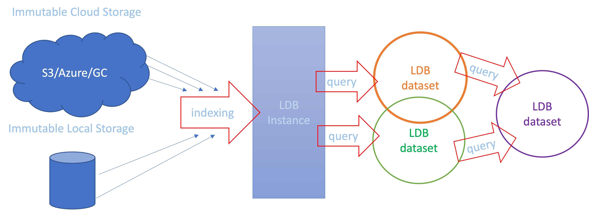

# α README

Label Database (**LDB**) is an **open-source** indexing tool for **data-centric** AI and machine learning projects. It works **upstream from model training** and organizes data in *cloud storages* and *data lakes* into reproducible logical datasets.

**LDB** aims to displace ad-hoc dataset management, data search and de-duplication tools – such as file folders, spreadsheets, and custom code for data selection/augmentation. In the upstream direction, LDB can interface with labeling software, and in the downstream direction LDB provides data files for clean training and evaluation pipelines – including modern registry-based model cards.

**Key LDB features**:

* **command line tool** (MLOps oriented). 
* LDB manages datasets as versioned collections of pointers into storage with automatic de-duplication
* Since LDB datasets use pointers, there is **no need** to **move or copy** data objects to create datasets. 
* LDB datasets are purely logical, so they are easily cloned, merged, sliced, and sampled. 
* LDB does not need write priveleges to storage, so losing an LDB instance does not affect the actual data objects.
* **Search in the cloud:** data objects can be selected based on JSON annotations, file attributes, or helper ML model queries 
* **Annotation tracking:** JSON annotation and metadata are tracked and versioned during indexing
* **Reproducibility and sharing:** every LDB dataset version always points to the same collection of data samples and can be easily shared
* **Cloud optimization:** LDB caches objects during instantiation, increasing speed and reducing cloud egress costs

### Contents

- [Installation](#installation)
- [How LDB works](#how-ldb-works)
- [What LDB can do](#what-ldb-can-do)
- [LDB tutorial](#ldb-tutorial)
- [LDB commands](#ldb-commands)
- [LDB versus other versioning tools](#ldb-versus-other-versioning-tools)
- [Contributing to LDB](#contributing)

## Installation

### pip **(PyPI core)**

```sh
pip install ldb-alpha
```

### installation with AWS and ML plugin support **(optional)**

```sh
pip install 'ldb-alpha [s3,clip-plugin,resnet-plugin]' 
```

### add anonymous access to public s3 datasets **(optional, only needed for [LDB team setup](documentation/Quick-start-teams.md))**
```
ldb add-storage s3://ldb-public/remote/ -o anon true
```
Sample datasets [are here](documentation/Datasets.md)

Supported metadata and dataset formats [here](documentation/formats.md)

Full LDB command summary [is here](documentation/Command-summary.md)


### How LDB works

LDB indexes immutable storage and notes unique data objects along with their associated annotations (if present). This index can then be queried to construct datasets that operate like collections of sparse pointers into the storage. LDB does not save data objects internally, and depends on their persistent storage locations to materialize (instantiate) datasets on demand.




LDB datasets can then be shared and versioned, which makes any membership changes (cloning, merging, splitting, adding, and removing objects) manageable and reproducible.

Whenever a dataset needs to be instantiated (for instance, to run a model experiment), LDB copies all relevant objects from cloud storage into the local workspace and recreates all linked annotations. Since storage is immutable and dataset state is kept within LDB, the local workspace can be safely erased after the experiment is complete. 

TODO: LDB supports local caching of instantiated data, so sucessive object materializations do not need to repeat cloud transfers.

## What LDB can do

<details>
  <summary>Cloud data retrieval, de-duplication and caching</summary>
  
ᐃ
  
The simplest way to form a dataset from cloud and materialize it in LDB is by using the [GET](documentation/Command-summary.md#get) command, which can point to cloud location, index it, add data objects into a specified dataset and instantiate it in one shot: 

```
ldb get s3://ldb-public/remote/data-lakes/dogs-and-cats/ -t animals
  
  Staged ds:.temp.2022-06-07T00:46:33.865467+00:00 at 'animals'
  Adding to working dataset...
  Added 200 data objects to ds:.temp.2022-06-07T00:46:33.865467+00:00
  Instantiating data...

  Copied data to workspace.
    Data objects:       200
    Annotations:        200

```
At this point, a public path s3 path was indexed, and 200 objects added to temporaty dataset in folder `animals`, after which the dataset was materialized. Let's try to add the same objects again to see how automatic de-deduplication works:

  ```
  cd animals
  ldb add s3://ldb-public/remote/data-lakes/dogs-and-cats/
  
    Adding to working dataset...
    Added 0 data objects to ds:.temp.2022-06-07T00:46:33.865467+00:00
  ```
LDB reads the contents of path but adds no new objects because it recognizes all input objects as duplicates.
  
TODO BETA: Another benefit of using LDB to service data objects from cloud locations is caching. When data engineers work on overlapping datasets, this normally requires duplicate file transfers from cloud bearing time and cost penalties. LDB solves this problem by using instantiation cache which accumulates data objects referenced on a particular machine. This layer of indirection may greatly speed up working with medium and large-sized datasets.

Cache function in LDB requires no explicit configuration and is enabled by default.
  
ᐃ
</details>

<details>
  <summary>Find and retrieve data samples by file attributes</summary>
  
ᐃ
  
Searching data by name patterns and file attributes is easy in filestystems with `find(1)` and similar tools, but is not readily available in the cloud. LDB fills this gap by storing file attributes in JSON format at indexing time and allowing to query them with JMESPATH expressions.

  For one example, time-based file search of objects in LDB index may look like this:

```
  ldb list ds:root --file 'fs.mtime > `2022-03-03`'
 
```
  
  For another example, retrieval based on the regular expression match in the path can be done as follows:
  
  
```
ldb get s3://ldb-public/remote/data-lakes/dogs-and-cats/ --path 'dog\.102[0-2]+' -t some-dogs
  
```
  
LDB stores file attributes collected during indexing in a JSON schema, so in the example above, flag `--path` is actually a shortcut for JMESPATH regex function applied to JSON `fs.path` attribute and is equivalent to ```--file 'regex(fs.path, `EXPR`)'```.  
  
  <details>
    <summary>Sample LDB-indexed file attributes</summary>

  ᐃᐃ
    
  ``` 
         ldb eval  id:98603fb145b88c265fb4a745e6aaf806   --file '@'

            id:98603fb145b88c265fb4a745e6aaf806
            {
              "alternate_paths": [
                {
                  "fs_id": "",
                  "path": "ldb-public/remote/data-lakes/dogs-and-cats/dog.1020.jpg",
                  "protocol": [
                    "s3",
                    "s3a"
                  ]
                }
              ],
              "first_indexed": "2022-06-07T03:00:54.270212+00:00",
              "fs": {
                "atime": null,
                "ctime": null,
                "fs_id": "",
                "gid": null,
                "mode": 0,
                "mtime": null,
                "path": "ldb-public/remote/data-lakes/dogs-and-cats/dog.1020.jpg",
                "protocol": [
                  "s3",
                  "s3a"
                ],
                "size": 26084,
                "uid": null
              },
              "last_indexed": "2022-06-07T03:00:54.270212+00:00",
              "last_indexed_by": "dkh",
              "tags": [],
              "type": "jpg"
            }
  ```

  ᐃᐃ
  </details>

File attribites schema works just like any other JSON, for example JMESPATH `--file` queries can be pipelined and use comparators and functions:
  
  ```
  ldb list ds:root --file 'fs.protocol[0] == `s3`' --file 'type == `jpg` && fs.size < `20000`'
  ```
  
ᐃ
</details>

<details>
  <summary>Retrieve data samples by querying JSON annotations</summary>

ᐃ

LDB relies on AWS JMESPATH language to query JSON annotations. JMESPATH is not a Turing-complete language, but it is sufficiently expressive to provide complex search capabilities without writing code. 
    
Most everyday data selection tasks appear simple and elegant in JMESPATH. For example, choose objects with confidence below a threshold:

  ```
  ldb list --query 'inference.confidence < 0.3
  ```
  JMESPATH is a powerful JSON expression reducer, and can be extended with [custom functions](documentation/Command-summary.md#user-defined-custom-query-functions). LDB also provides some handy functions out of the box, for example – to compute the total area of (possibly overlapping) bounding boxes for all images in workspace, one can project dimension metrics into arrays and use dotproduct(array, array) to compute the final result:
  
  ```
  ldb eval --query 'dotproduct(b_boxes[*].width, b_boxes[*].height))'
  ```
Please refer to the [queries](documentation/LDB-queries.md) document for more examples of JMESPATH expressions.
  
ᐃ
</details>

<details>
  <summary>Search data samples with ML helpers</summary>

ᐃ 
  
Sometimes there is a need to locate data samples that lack annotations, or must be indentified by criteria other than labels. In that case, LDB provides a convenience harness for programs that can filter or sort samples by looking deeper. 
    
For example, the following line uses ML helper to detect cat colors (which are not present in annotations):

  ```
  ldb list s3://ldb-public/remote/data-lakes/dogs-and-cats/ --pipe clip-text 'black cat' --limit 10
  ```
  
  Since helpers can be computationally expensive to run, it also makes sense to reduce their scope of operation. LDB queries are pipelined, which means flags are executed in the order of appearance and can be used to limit the scope for downstream ML filters:
  
  ```
  ldb list s3://ldb-public/remote/data-lakes/dogs-and-cats/ --path 'dog\.10[0-2]+' --pipe clip-text 'black dog' --limit 3

  ```
 
ᐃ
</details>

<details>
  <summary>Slice/dice and merge datasets</summary>

ᐃ 
  
LDB supports many ways to manipulate dataset membership. For example, the following expression merges two datasets, shuffles the result and dispenses first 100 members into the workspace.

  ```
  ldb add ds:dogs ds:cats --shuffle --limit 100
  ```
  
  Similarly, here is a way to add objects present in dataset A but not present in dataset B:
  
  ```
  ldb add ds:A
  ldb del ds:B
  ```
  
  Membership operations are not limited to named datasets already saved into LDB. For example, one can stage unnamed (temporary) dataset with `GET` and sample the result using the workspace notation `ws:`:
  
  ```
  ldb stage animals
  ldb get s3://ldb-public/remote/data-lakes/dogs-and-cats/ --path 'dog\.10[0-2]+' -t more-animals/
  ldb add ws:./more-animals --sample 0.5
  ```
 
ᐃ
</details>
 
<details>
  <summary>Version-control datasets</summary>

ᐃ
  
Version control is key to engineering discipline and result reproducibility. Most work in LDB happens in incremental changes that modify a temporary (workspace) dataset, but once this dataset is ready and is committed to LDB, it receives a linear version number (1,2,3 etc):

  ```
  ldb get s3://ldb-public/remote/data-lakes/dogs-and-cats/ --path 'dog\.10[0-2]+' -t more-animals/
  cd more-animals/
  ldb commit -name ds:more-animals
  ```
  
  In the example above, folder `more-animals` is first staged with unnamed dataset, and then populated with data from cloud. The result is committed back into LDB and assigned a version number. A dataset reference without version number means the latest version, but a specific version can be also addressed:
  
  ```
  ldb stage ds:more-animals.v1 -t temporary/
  ```
 
ᐃ
</details>

</details>
 
<details>
  <summary>Version-control annotations</summary>

ᐃ
  
Annotation updates are quite common, which is why LDB datasets consist of tuples (data object, annotation version). A new annotation version is created in LDB every time a sample is re-indexed. Note that new annotation version in LDB index is not automatically pushed to the datasets pointing towards the older version.

  ```
  ldb get s3://ldb-public/remote/data-lakes/dogs-and-cats/
  sed -i 's/class=dog/class=cat/g' dog-1009-7918d986e52f3b939ef49020307837b2.json
  ldb index dog-1009-7918d986e52f3b939ef49020307837b2.json
  ```
  ^^^
  This have physically changed one annotaton and updated it in LDB index, but the logical information about this annotation in the workspace has not changed. For that, one needs to use PULL command:
  
  ```
  ldb pull dog-1009-7918d986e52f3b939ef49020307837b2.json
  ```
ᐃ
</details>

<details>
  <summary>Dataset-level transform configurations</summary>

ᐃ
  
Feeding data into the model often requires pre-processing. For example, a model might use just the crops of the image in bounding boxes, or still pictures extracted from a video object. Similarly, a pre-processor might take the original data and augment it to increase the number of samples.
  
  Traditionally, this functionality is written as code predating the training phase, which obscures the important dataset parameters and makes it harder to work with modular card-level models that lack pre-processors.
  
  LDB addresses this problem by allowing for transformation configuration to be baked into the dataset, where some (or all) objects are passed through transformation plugins during instantiation. This keeps data-level modifications parameters bound to dataset itself, and leaves no hidden states for data entering the model. 
  
  By default, every LDB object in any dataset has one (self-identity) transform in the transformation set:
  
  ```
  ldb list
      Data Object Hash                      Annot  Data Object Path          Transforms              
       id:011caf8c8bc2a2d715ff1262a80dccdb   2      ...and-cats/cat.1011.jpg  self
  ```
  
  However, the transformation set can have any number of actions configured:
  
  ```
  ldb transform -s rotate-90,rotate-180
    Set transforms for 1 data objects in ds:ls-objects
  ldb list
      Data Object Hash                      Annot  Data Object Path          Transforms              
       id:011caf8c8bc2a2d715ff1262a80dccdb   2      ...and-cats/cat.1011.jpg  rotate-180,rotate-90
  ```
  see [command summary](documentation/Command-summary.md#transform) for more information on how to configure plugins.
  
ᐃ
</details>

## LDB tutorial

Here is an [end-to-end workflow](documentation/Getting-started-with-LDB.md) for a Data-centric AI task with LDB

## LDB commands

<details>
  <summary>LDB command cheat sheet</summary>
  
ᐃ

> **LDB instance** is a persistent structure where all information about known objects, labels and datasets is being stored. If no LDB instance is found, a private one will be created automatically in the `~/.ldb` directory the first time an LDB dataset is staged. To set up a shared LDB instance for a team or an instance in a different location, please follow [LDB team setup](documentation/Quick-start-teams.md).
 
>**LDB dataset** is a collection of pointers into storage. 

 ### Staging a new dataset 

 Whenever a new dataset is required – or an existing dataset needs an update, it must first be staged in an empty folder (data workspace). Staging does not automatically instantiate the dataset, but creates a draft state of dataset membership info and metadata. LDB prefixes dataset names with `ds:`

 | Step | Command |
 | --- | --- |
 | Create a workspace folder | `$ mkdir working-dataset; cd working-dataset` |
 | Create a new dataset in the workspace | `$  ldb stage ds:my-cats ./` |
 | Check the status of staged data | `$  ldb status ` |

 While working in this workspace, all subsequent dataset manipulations will apply to the staged dataset. 

 Logical modifications to dataset staged in the workspace are usually made with ADD and DEL commands that may reference individual objects, other datasets, and employ annotation queries (see [LDB queries](documentation/LDB-queries.md) for details).

 **Configuring immutable storage locations (optional)**

 LDB assumes data samples live in immutable locations from which they are indexed. By default, a private instance will treat any cloud location as immutable, and any local filesystem path as ephemeral. LDB automatically attempts to copy data samples from ephemeral locations into internal storage (defaults to `~/.ldb/read_add_storage`) during indexing. To prevent this behavior while indexing local storages, register them with `ADD-STORAGE` command:


 | Step | Command |
 | --- | --- |
 | Register some immutable storage location  | `$  ldb add-storage ~/dogs-and-cats` |

 Please remember that LDB is an indexing service. If you move or erase indexed data samples from storage, LDB index may break.

 ### Indexing storage folder

 Once the storage location is registered, it can be indexed. During indexing, LDB recognizes all unique objects and associates them with annotations (if present). Whenever new samples are added, their location must be reindexed for LDB to pick the changes. Annotations updated for the old data objects will be registered with a new version.

 | Step | Command |
 | --- | --- |
 | Index images from storage | `$ ldb index ~/dogs-and-cats` |

 ### Modifying a dataset

 | Step | Command |
 | --- | --- |
 | Add cat objects from index by annotation | ```$ ldb add ds:root —-query 'class == `cat`'``` |
 | Check the status of a staged dataset | `$  ldb list`|

 Note the use of single quotes to shield query from shell expansion, and the use of backticks to denote the literal value ("cat"). Also note that a special name `ds:root` designates the entire LDB index which references all known objects. 

 LDB is also not limited to querying the existing annotations. If installed, [custom ML plugins](documentation/Plugins.md) can be employed for queries beyond JSON:

 | Step | Command |
 | --- | --- |
 | Add objects by ML query: | `$ ldb add ds:root --pipe clip-text 'orange dog' --limit 10` |
 | Check the status of a staged dataset | `$ ldb list`|

 At this point, our workspace holds membership info for all cat images from sample dataset, and ten images that best resemble an orange dog. It is okay to have same objects added to a dataset multiple times as LDB automatically deduplicates. Once we are happy with results, this dataset can be instantiated (materialized) in the desired output format to examine the samples or train the model.

 ### Instantiation

 | Step | Command |
 | --- | --- |
 | Instantiate all objects into the workspace | `$ ldb instantiate `|
 | See the resulting physical dataset | `$ ls`|

 After examining the actual data objects, one might decide to add or remove data samples, or to edit their annotations.
 LDB can pick the resulting changes right from the workspace:

 ### Notifying LDB on workspace modifications

 | Step | Command |
 | --- | --- |
 | Edit some annotation     | `$ sed -i 's/dog/cat/g' dog-1088.json` |
 | Inject a new annotated sample directly into workspace | `$ cp ~/tmp/dog-1090.* ./`
 | Pick object and annotation changes from workspace | `$ ldb add ./`|

 To save staged dataset into LDB (with all the cumulative changes made so far), one needs to use the *commit* command.

 ### Dataset saving and versioning

 | Step | Command |
 | --- | --- |
 | Push a new version of staged dataset to LDB | `$ ldb commit` |

 Every new commit creates a new dataset version in LDB. By default, a reference to an LDB dataset assumes the latest version. Other dataset versions can be explicitly accessed with a version suffix:

 | Step | Command |
 | --- | --- |
 | Stage a particular version of a dataset | `$  ldb stage ds:my-cats.v3` |
 | Compare current workspace to a previous dataset version | `$  ldb diff ds:my-cats.v2`|

 If newer annotations will become available for the data object, they can be readded to dataset by name. If all labels need to be updated, this can be done with the *pull* command.

 TODO BETA: **Granular annotation versioning**

 | Step | Command |
 | --- | --- |
 | Add object with particular label version | `$  ldb add —-label-version 2 aws://my-awesome-bucket/1.jpg ` |
 | Bump label version for an object to latest | `$   ldb add aws://my-awesome-bucket/1.jpg` |
 | Bump all labels in a dataset to latest | `$ ldb pull`|

ᐃ
</details>

Full LDB command summary [is here](documentation/Command-summary.md)
## LDB versus other versioning tools

Without a program like LDB, engineers iterating on data commonly accept one of the following data management recipes: (1) datasets as file folders, (2) datasets as pointers stored in spreadsheets (or database records), or (3) datasets under control of ML frameworks. All these solutions have their limits we discuss in greater detail [here](/documentation/alternatives-to-LDB.md).

Datasets can also exist under general versioning tools like (like [DVC](https://dvc.org/) or [PachyDerm](pachyderm.com)). The disadvantage of general versioning is in destruction of the original storage layout. For example, when DVC manages the model repository, it takes full ownership of data and caches the actual data samples. This can be problematic from data engineering perspective because every model has its own data cache and global data management and search becomes chalenging.

On the opposite, LDB is an indexing service, and treats datasets as collections of pointers. This lightweight approach requires storage immutability, but can accept any data in its original form (together with locations, folders, names, etc). Indexing allows LDB to operate without write access to storage and leave storage management to data engineers. In addition, LDB understands annotations and can group sparse objects into datasets by annotation queries. These abilities forms a natural boundary between dataset utilities like LDB and model/experiment management tools like DVC: LDB organizes data, while DVC manages the rest of ML pipeline.  

## Contributing

Contributions are welcome! Pre-beta testers, please contact us for access.

