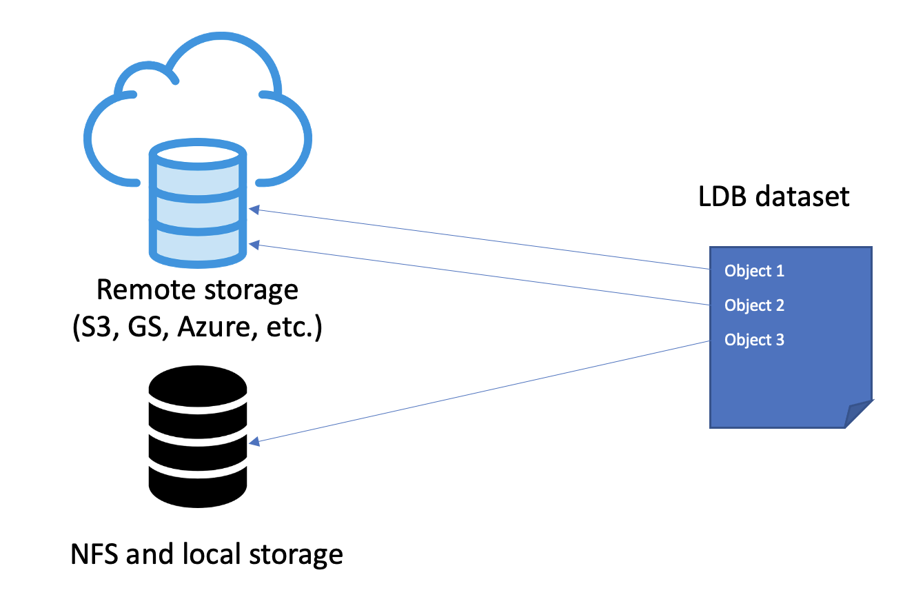

# α README

Label Database or **LDB** is an **open-source** tool for **data-centric** science and machine learning projects. It works **upstream from model training** and intends to organize **data in your existing storage or data lake** into virtual datasets.

**LDB** aims to displace ad-hoc dataset management and de-duplication tools – such as file folders, spreadsheets and SQL databases. In the upstream direction, LDB can interface with labeling software, and in the downstream direction LDB integrates with model-based ML pipelines. 

**Key LDB features**:

*  MLOps-grade **command line** experience. Does not require installing and maintaining any databases. 
* Lightweight management of data sources. Data objects can exist anywhere in S3, Google Cloud, Azure, or local storage. There is **no need to move or duplicate data objects** in order to create, share or modify datasets. 
* Advanced management and versioning of datasets. Datasets can be cloned, queried, merged, and sampled. **Every change in a dataset is tracked**, and provenance of constituent objects can be verified at all times.
* Label-aware operations. **Objects can be selected based on annotation metadata, file attributes, or custom ML model query**, and changes to ingress object metadata are versioned. 
* **LDB datasets are reproducible,** **shareable, and fast to materialize**. A particular dataset version will always point to the same set of data objects and annotations. Datasets are cached during instantiation, so transfers from cloud locations are accelerated.

### Contents

- [How LDB works](#how-ldb-works)
- [Quick start](#quick-start)
- [Installation](#installation)
- [Comparison to related technologies](#comparison-to-related-technologies)
- [Contributing to LDB](contributing-to-LDB)

### How LDB works

LDB indexes immutable storage locations and notes all unique data objects along with their associated annotations (if present). This index can then be queried to construct datasets that work like collections of sparse pointers into the storage:



The main use case for LDB arises when a data scientist wishes to create and maintain a persistent collection of cloud-based objects that are grouped into virtual datasets by some logical criteria (e.g. annotated with a certain class, created at given time, satisfy a particular name pattern, etc). 

These virtual datasets can then be shared and versioned within LDB, which makes collaboration on dataset membership state (cloning, merging, splitting, adding, and removing objects) easily manageable and reproducible.

Whenever a virtual dataset needs to be instantiated (for instance, to run a model experiment), LDB copies all relevant objects from storage into the model workspace and compiles the linked annotations. Since storage is immutable and all dataset membership state is kept within LDB, the workspace can be safely erased after the experiment is complete.

## Quick Start
Please refer to [Getting Started with LDB](documentation/Getting-started-with-LDB.md) for a full version of this document.

**LDB instance** is a persistent structure where all information about known objects, labels and datasets is being stored. A private LDB instance will be created automatically in the `~/.ldb` directory the first time an LDB dataset is created or an LDB query is run. To set up a shared LDB instance for a team or organization, please follow [Quick Start for Teams](documentation/Quick-start-teams.md).

Whenever a new dataset is required or an existing dataset needs an update, it must first be staged in the model workspace. Staging does not automatically instantiate the dataset, but creates a draft state of the dataset membership info and all metadata:

### Stage a new virtual dataset 

| Step | Command |
| --- | --- |
| Create a new dataset in the workspace | `$  ldb stage ds:my-new-dataset ./` |
| Check the status of staged data | `$  ldb status ` |
| List all objects in current workspace | `$  ldb list `|

All subsequent dataset manipulations will apply to this staged dataset. 

Logical modifications to dataset staged in the workspace are usually made with ADD and DEL commands that may reference individual objects, other datasets, and employ annotation queries (see [LDB queries](documentation/LDB-queries.md) for details).

### Modifying a virtual dataset

| Step | Command |
| --- | --- |
| Add objects by annotation | `$  ldb add s3://iterative.ai/ImageNet-1K —-query *class == "cat"` |
| Sample objects from a location | `$  ldb add azure://iterative.ai/OpenImage-1K --sample-rate 10` |
| Check the status of a staged dataset | `$  ldb list`|

LDB is not limited to querying existing annotations. A custom ML model can be used to provide query terms beyond JSON fields:

| Step | Command |
| --- | --- |
| Add 100 objects by ML query: | `$  ldb add gs://iterative.ai/COCO-3K —-ml clip == "dancing dog" --num 100` |
| Check the status of a staged dataset | `$  ldb list`|

At this point, our virtual dataset in the workspace consists of all cat images from ImageNet, randomly sampled images from COCO, and ten images that mostly resemble dancing dogs from OpenImage. Once a virtual dataset is ready, it can be instantiated (materialized) in the desired output format to train the model.

### Instantiation

| Step | Command |
| --- | --- |
| Instantiate all objects into the workspace | `$  ldb instantiate --output-format coco`|

After examining the actual data objects and annotations, one might decide to add or remove data samples manually, or edit their annotations.
LDB can pick the resulting changes right from the workspace:

### In-place modifications

| Step | Command |
| --- | --- |
| Pick any object or annotation changes that happened in workspace | `$  ldb add ./`|

To save the staged dataset into LDB (with all the cumulative changes made so far), one needs to use the *commit* command.

### Dataset saving and versioning

| Step | Command |
| --- | --- |
| Push a new version of staged dataset to LDB | `$  ldb commit` |

Every new commit creates a new dataset version in LDB. By default, a reference to an LDB dataset assumes the latest version. Other dataset versions can be explicitly accessed with a version suffix:

| Step | Command |
| --- | --- |
| Stage a particular version of a dataset | `$  ldb stage ds:my-cats.v3` |
| Compare current workspace to a previous dataset version | `$  ldb diff ds:my-cats.v2`|

If newer annotations will become available for the data object, they can be readded to dataset by name. If all labels need to be updated, this can be done with the *pull* command.

### Annotation versioning

| Step | Command |
| --- | --- |
| Add an object with particular label version | `$  ldb add aws://my-awesome-bucket/1.jpg —label-version 2` |
| Bump label version for an object to latest | `$   ldb add aws://my-awesome-bucket/1.jpg` |
| Bump all labels in a dataset to latest | `$ ldb pull`|
 

## Comparison to related technologies

A fair question when considering a new ML tool is whether it is worth the investment of time and effort to adopt. This section discusses some LDB alternatives.

First and foremost, **LDB is focused on data-driven ML cycles**. This means it is most useful when data corpus is dynamic, and where the model is expressive enough to benefit from improved data samples and annotations. 

Without the use of LDB, a team facing the problem of training on better data typically attempts to organie their data sources into datasets by one of the following three recipes:

1. Folder-level dataset organization.

The default method to create datasets is by copying data samples into named file folders. This method has an advantage of being the simplest way to bootstrap a new project, yet it comes with serious limitations:

* Experimenting on data (adding or removing data objects) results in multiple copies of the *same* dataset with minimal changes – which is undesirable for datasets of non-trivial sizes.

* Folders are not easy to slice and dice, and retain no metadata to keep track of changes and object provenance (which data sample came from which source). 

* Attempts to add new data objects may result in repetitions (same object under multiple names), or data loss (samples overwritten by mistake).

* Annotation updates are not tracked, which may cause annotations going stale.

* Unrestricted folder-level modifications are difficult to integrate with privacy policies and access directives.

2. Spreadsheets, or other database-powered datasets design.

A reasonable step up from managing datasets in folders is to organize them as spreadsheets filled with object pointers (URIs of data objects living in cloud locations). 

This method permits for sparse datasets where individual objects are no longer required to reside in one folder or cloud bucket. Since spreadsheet-based datasets decouple storage from membership, they no longer require objects to be copied or moved to form new datasets, permit to store provenance meta-information as attributes, and can be compatible with privacy policies. In addition, versioning for datasets and annotations can be provided for by means of storing multiple linked tables corresponding to versions.

Spreadsheets, however, still carry significant limitations: 

* They do not solve the problem of repetitions (same data objects listed under different URIs), and cannot prevent annotations from going stale. Both of these problems require tracking objects by content which spreadsheets cannot do.

* Spreadsheets do not provide native means to assemble datasets with queries. This means an ML engineer needs to compose them manually, or use ad-hoc software to query annotations and export lists of the matching objects into the spreadsheets and tables.

* Use of spreadsheets and databases to store datasets forces ML engineers to use unfamiliar tools that are hard to integrate with MLOps. Forming a dataset and registering it in a database is a prcess with many touching points.

3. Heavyweight ML frameworks.

It is fairly common to find parts of functionality offered by LDB in the large, heavyweight ML frameworks. For example, any data labeling software suite likely has some function to track annotation versions and search annotations by fields. Likewise, every end-to-end ML platform facilitates organization of input data into the datasets, at least at the folder level. 

While heavyweight ML platforms can be very successful in vertical-specific applications, they are difficult to recommend as one-size-fits-all tools.

Unlike these platforms, LDB follows Unix toolchain philosophy and solves exactly one problem – it sits between the (immutable) data storage and mutable model training workspace, and allows for reproducible and fast data-driven ML iteration. This enables an easy integration with any labeling software upstream, or any experiment automation downstream.

4. DVC.

Last, but not least question, is why one should choose LDB over DVC since both platforms provide data versioning capabilities.
The answer is that these platforms are complementary and do not overlap. 

DVC actively manages the model repository, and therefore DVC treats datasets as physical file folders under control. On the other hand, LDB is an indexing service over immutable storage locations, hence LDB datasets are virtual, not physical. LDB understands annotations, and can group sparse objects into datasets by queries.

If your data is indexed in storage by LDB while your models already live in DVC, the two tools can happily work together. DVC recognizes LDB datasets as first-class objects, and LDB can utilize the shared DVC cache.

## Installation

### pip **(PyPi)**

```bash
pip install ldb
```

### brew **(Homebrew/Mac OS)**

```bash
brew install ldb
```

## Contributing

```diff
- boilerplate contribution call to action
```
