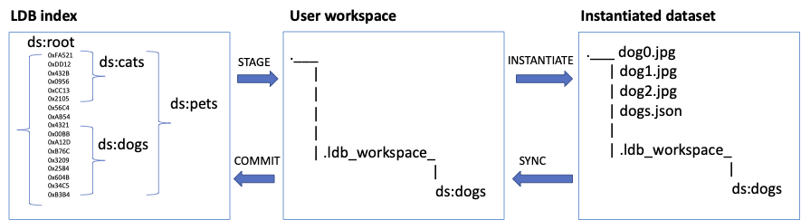

# β README

Label Database (**LDB**) is an **open-source** tool for **data-centric** AI and machine learning projects. It works **upstream from model training** and intends to index data in the *cloud storages* and *data lakes*, organizing pointers to data samples into datasets.

**LDB** aims to displace ad-hoc dataset management and de-duplication tools – such as file folders, spreadsheets and SQL databases. In the upstream direction, LDB can interface with labeling software, and in the downstream direction LDB integrates with model-based ML pipelines. 

**Key LDB features**:

*  MLOps-grade **command line** experience. 
* Lightweight management of data sources. Data objects can exist anywhere in local storage, S3, Google Cloud, or Azure. There is **no need** to **move or duplicate** data objects in order to create, share or modify an LDB dataset (named collection of pointers).
* Advanced manipulation and versioning for datasets. Collections can be cloned, queried, merged, and sampled. **Every change in a dataset is tracked**, and provenance of constituent objects can be verified at all times.
* Label-aware operations. Objects can be selected based on **annotation metadata, file attributes, or custom ML model queries**, and changes to ingress object metadata are versioned. 
* **LDB datasets are reproducible,** **shareable, and fast to materialize**. A particular dataset version will always point to the same set of data objects and annotations. Data samples can be placed in a shared cache during instantiation, so transfers from remote locations are accelerated.

Full LDB command summary [here](documentation/Command-summary.md)

### Contents

- [Installation](#installation)
- [How LDB works](#how-ldb-works)
- [Quick start](#quick-start)
- [Comparison to related technologies](#comparison-to-related-technologies)
- [Contributing to LDB](#contributing)

## Installation

### pip **(PyPI core)**

```sh
pip install ldb-alpha
```

### installation with ML plugins **(optional)**

```sh
pip install 'ldb-alpha[clip-plugin,resnet-plugin]' 
```

### How LDB works

LDB indexes immutable storage locations and notes all unique data objects along with their associated annotations (if present). This index can then be queried to construct datasets that work like collections of sparse pointers into the storage. Note that LDB does not save data objects internally, and relies on persistent storage locations to serve data objects in the future. This means it is safe to give LDB access to storage as it never needs privileges to erase or modify data samples.


The main use case for LDB is to create and maintain persistent collections of cloud-based objects. These collections (datasets) are filled by logical queries into the index or into other datasets (e.g. samples annotated with a certain class, created at given time, having a given number of masked instances, etc). 

Datasets can then be shared and versioned within LDB, which makes collaboration on dataset membership state (cloning, merging, splitting, adding, and removing objects) manageable and reproducible.

Whenever a dataset needs to be instantiated (for instance, to run a model experiment), LDB copies all relevant objects from storage into ephemeral workspace and compiles the linked annotations. Since storage is immutable and all dataset state is kept within LDB, this workspace can be safely erased after the experiment is complete.

## Quick Start
Please refer to [sample LDB workflow](documentation/Getting-started-with-LDB.md) for more a detailed example of Data-driven AI methodology and to [command summary](documentation/Command-summary.md) for additional information on command options.

**LDB instance** is a persistent structure where all information about known objects, labels and datasets is being stored. To set up a shared LDB instance for a team or organization, please follow [LDB team setup](documentation/Quick-start-teams.md). If no LDB instance is found, a private one will be created automatically in the `~/.ldb` directory the first time an LDB dataset is staged. 

### Forming datasets by querying annotations

Ability to issue complex queries is key to dataset formation in LDB.  For demo purposes, we will use a web-hosted dataset with annotations in the following JSON format that denote images with animal class, size, and eye positions:

```
{ 
  "class": "cat",
  "size": "large",
  "features": {"left-eye":{"x": 318, "y": 222}, "right-eye":{"x": 340, "y": 224}},
}
```

| Step | Command |
| --- | --- |
| Install LDB | ```$ pip install 'ldb-alpha[clip-plugin,resnet-plugin]'``` |
| Cats size L | ```$  ldb get s3://ldb.ai/ds/cats/ --query 'size == `large`' large-cats ``` |
| Small heads | ```$ ldb get ds:root --query 'sub(features."right-eye".x,features."left-eye".x) < `30`' small-head ``` |

Now we should have folder `"large-cats"` with instantiated data samples annotated as `"size": "large"`, and folder `"small-head"` with samples annotated for horizontal distance between cat eyes less than 30 pixels. To run complex JSON queries, LDB supports extended JMESPATH language (see [LDB queries](documentation/LDB-queries.md) for details).

* Note that objects in folders `"large-cats"` and `"small-head"` can be overlapping, but LDB uses local cache to avoid duplication.
* Also note that the first query explicitly referenced cloud storage, while the second did not. LDB indexes unknown data objects at first encounter, so subsequent queries can run from the internal LDB index addressable under the reserved name "root".

### Creating datasets from querying data objects directly

Querying annotations and labels is not the only way to create datasets. In addition to specifying data objects by paths, file attributes and annotation features, LDB can use plugins to filter objects by features missing in annotations. For example, we can use semantic search through the index of cat images:

| Step | Command |
| --- | --- |
| Create dataset by ML query: | `$ ldb work --pipe clip-text 'orange cat' --limit 10 orange-cats` |

LDB ships with CLIP and ResNet plugins for image filtering, but [custom ML plugins](documentation/Plugins.md) can be added for other data types.

### Saving and versioning datasets

We have used `WORK` command in the previous section to create two folders, each with a collection of data objects and annotations. LDB refers to a folder that holds such collection as *workspace*. Most LDB commands are designed to run from within the workspace, using it as a context.

A workspace can be made into a named dataset by saving it to LDB:

| Step | Command |
| --- | --- |
| Change into workspace | `$ cd ./large-cats` |
| Save this dataset into LDB | `$ ldb commit` |

Now dataset `ds:large-cats` is saved. Since LDB defines the dataset as a collection of specific data objects and annotation versions, any version of a dataset will remain reproducible. 

If we change a dataset and save it again, this will create a new version, but we can still refer to the previous one if needed:

| Step | Command |
| --- | --- |
| Remove one data object | `$ ldb del ./cat1_008.jpg` |
| Save modified dataset into LDB | `$ ldb commit` |
| Compare to a previous version | `$ ldb diff ds:large-cats.v1` |

* Note LDB uses prefix `ds:` before dataset names and postfix `.vNN` to reference a particular dataset version.
* Since LDB is an indexing service, locally instantiated dataset is fully disposable. 

| Step | Command |
| --- | --- |
| Save workspace "orange-cats" | `$ cd ../orange-cats; ldb commit` |
| But delete workspace "small-heads" | `$ cd .. ; rm -rf ./small-heads` |

Deletion of workspace does not affect LDB index or data objects in storage.

### Logical operations in workspace

LDB groups data objects and annotations into datasets by references. This means dataset membership information change is a logical operation that does not require physical data objects to be present. This is important, for example, when a dataset is large and inconvenient to materialize every time a minor membership change is required.

Therefore, LDB normally uses separate commands to stage a dataset (create a workspace), change dataset membership, and instantiate:



LDB index holds references to all known data objects by hash-sums (object-ids) in a dataset with a special name _ds:root_. Any other datasets can be saved into LDB referring to arbitrary combinations of objects and annotation versions. In the example above, LDB has three datasets: _ds:cats_, _ds:dogs_, and _ds:pets_. Command STAGE takes dataset name as an argument and copies meta-information about this dataset from index into a workspace (or creates a new one if does not exist). At this point, objects can be added to workspace with ADD, or removed with DEL. A dataset is saved back to LDB index with COMMIT.

Note, that instantiation is not a pre-requistite for changing the dataset with ADD and DEL. Whenever access to physical objects is required, INSTANTIATE command is used to materialize the dataset partially or fully. It is also possible to modify physical objects in workspace and pick the changes back with SYNC.

LDB command WORK that we have used in the previous sections simply unites STAGE, ADD, and INSTANTIATE. It is a one-liner that can stage a named dataset, add objects to it by query, and instantiate the result. 

### Dataset algebra

What is the intersection of workspaces `"large-cats"` and `"orange-cats"` ? How to unite two datasets into a third one? What is the way to assemble a balanced dataset from multiple classes? 

LDB can answer these questions by combination of ADD, DEL, and LIST commands with queries. Query syntax in LDB uses the following building blocks:

* source objects: come from any combination of datasets (`ds:`_NAME_), workspaces (`ws:`_FOLDER_), storage paths, or object-ids (hashsums)
* query pipeline: combination of JSON queries via `--query`, sampling and limiting options `--sample`, `--shuffle`, `--limit`, and plugins with `--pipe`

Examples: 

Combining two datasets:

| Step | Command |
| --- | --- |
| Make a new workspace | `$ ldb stage ds:test ./` |
| Add two datasets | `$ ldb add ds:large-cats ds:orange-cats` |
| Subtract a dataset | `$ ldb del ds:orange-cats` |

Intersection of two queries:

| Step | Command |
| --- | --- |
| Count cats that are large | ```$ ldb list -s ds:root --query 'class == `cat`' --query 'size == `large`'``` |
| alternative syntax | ```$ ldb list -s ds:root --query 'class == `cat` && size == `large`'``` |

Fill quota per class:

| Step | Command |
| --- | --- |
| Shuffle and limit the source | ```$ ldb list ds:root --query 'class == `cat`' --shuffle --limit 10'``` |


### Storage indexing and object tags

In the examples above, we have seen how a cloud location can be indexed at first reference by WORK command. In LDB, both ADD and WORK can index unseen objects from storage path implicitly.

However, there are also cases where explicit indexing is preferable. For one example, indexing a large storage location may take time and is best scheduled in off-peak hours. For another example, source data can come with annotations in format other than LDB default and needs to be converted. For a third example, annotations can be periodically updated and need to be loaded into index.

| Step | Command |
| --- | --- |
| Index storage location in default format | `$ ldb index s3://ldb-public/dogs-and-cats` |
| Index location in Tensorflow format | `$ ldb index --format infer gcp://ldb-public/dogs-and-cats`|

Another use of explicit indexing in LDB is object tagging. Object tags in LDB are global – which means the tag assigned to a data object is visible in all datasets that reference it regardless of annotation presence and versions. Tags can be assigned during index or later (via TAG command):

| Step | Command |
| --- | --- |
| Index storage path and assign tags | `$ ldb index s3://ldb-public/cats/cat.100'*' --add-tags cats,testing` |
| Make sure test objects did not leak into current workspace | `$ ldb del ws:./ --tag testing` |

* Note the quoted asterisk to denote S3 path wildcard

Finally, let us touch on the topic of storage immutability. LDB relies on existence of data objects in storage and requires them to be stable. For this reason, LDB keeps track of registered storage locations via command `ADD-STORAGE` and normally will not index data outside these locations – such from local directories. However, it is also possible to configure a special `read-add` storage, where LDB will copy data objects indexed outside registered paths. In private LDB instance, by default, all cloud locations are considered immutable, and `read-add` storage is configure user's homepage. Therefore, the following commands will work:

```
$ ldb stage ds:cats ./
$ cp ~/storage/cat1.* ./   # bring some object from unregistered storage together with .json
$ ldb add ./cat1.jpg       # result: staged dataset ds:cats now includes cat1.jpg
```

### Annotation versioning

LDB keeps track of annotation versions and increments them in index every time a new version is found. In the meanwhile, sample in the dataset keeps the version of annotation it was coupled with when added. In case of conflict a where dataset gets a sample with both earlier and later annotation version, the latest wins.

For example, let us assume we staged a dataset `ds:cats` that contain object id 0xffc9779b0ff19 with annotion v.1 of the following form:

```
{ 
  "class": "cat",
  "object-id": {
    "md5": ffc9779b0ff19
  }
}
```

If we instantiate this object, this is the annotation we are going to see:

| Step | Command |
| --- | --- |
| Instantiate this object | `$ ldb instantiate 0xffc9779b0ff19` |
| Examine the result  | `$ cat ffc9779b0ff19.json`    |

Now let us change this annotation in-place and re-index:
 
| Step | Command |
| --- | --- |
| Change class in annotation | `sed -i 's/dog/cat/g' ffc9779b0ff19.json` |
| Re-index this object | `$ ldb index ./ffc9779b0ff19.json ` |

At this point, LDB index has object id 0xffc9779b0ff19 with annotion v.2, which we can verify:

| Step | Command |
| --- | --- |
| Show JSON from index | `$ ldb eval 0xffc9779b0ff19` |

However, dataset `ds:cats` would still have this object with annotation v.1, because this was the annotation version it was added with. To update:

| Step | Command |
| --- | --- |
| Re-add same object with latest annotation from index | `$ ldb add 0xffc9779b0ff19` |
| Alternatively, use PULL command | `$ ldb pull 0xffc9779b0ff19` |

Finally, since index now stores both annotation version, it is possible to explicitly mention it in queries:

| Step | Command |
| --- | --- |
| Enforce non-default annotation version | `$ ldb add  0xffc9779b0ff19 --apply-version 1` |
| Construct filter based on annotation version comparison | `$ ldb add --vquery 'v1.class != v2.class'` |


### Query debugging

JMESPATH queries can become complicated, so it is useful to understand how LDB constructs and evaluates them.

LDB treats any expression that results in null, boolean false, or an empty objects as 'falsy' that fails the filter, and treats every other output (including 0) as 'truthy' that passes the filter. Any reference to a non-existing key immediately fails the filter.

To understand exactly what LDB does in each case, it is useful to utilize EVAL and observe the result of  JSON query reduction. EVAL without --query simply returns the entire latest annotation:

```
$ ldb eval  0xffa97795d32350dc450f41c4ce725886
0xffa97795d32350dc450f41c4ce725886
{
  "class": "dog",
  "id": "1025",
  "inference": {
    "class": "cat",
    "confidence": 0.56
  },
  "num_annotators": 3
}
```

A missing key produces 'false' – which means this query would fail the filter:

```
ldb eval  0xffa97795d32350dc450f41c4ce725886 --query 'inference.time'
0xffa97795d32350dc450f41c4ce725886
false
```
A valid JMESPATH expression should produce valid object that passes the filter:

```
ldb eval  0xffa97795d32350dc450f41c4ce725886 --query 'inference.time'
0xffa97795d32350dc450f41c4ce725886
{
  "class": "cat",
  "confidence": 0.56
}
```

### Advanced instantiation options

We already saw that LDB can instantiate a dataset partially of fully using WORK or INSTANTIATE (with an optional format change).
There are, however, two more instantiation options that can be useful.

First, `--infer` allows reconstructing a dataset using a plugin that can modify annotations, objects, or both. This can be useful, for example, for applying a helper ML model to pre-annotate or gauge data object complexity:

| Step | Command |
| --- | --- |
| Instantiate this object | `$ ldb instantiate 0xffc9779b0ff19 --infer ` |
| Reindex results  | `$ ldb index ./ffc9779b0ff19.json`    |

Second, `--apply` option can be employed with ADD to permanently reference a transformation plugin – such as an augmentation routine, or still picture extraction from video based on the annotation mask. Multiple transformations can attach to the same input sample, and every transformation can be a sequence of actions (e.g. rotate, flip, etc):

| Step | Command |
| --- | --- |
| Apply flip transform | `$ ldb add ds:numerals --apply  flip_augmentation --sample 0.1` |


## Comparison to related technologies

One good question when considering a new ML tool is whether it is worth the investment of time to adopt. 

Without a tool like LDB, a team iterating on data typically takes one of the common recipes: (1) datasets as file folders, (2) datasets as spreadsheets, or (3) datasets under control of ML framework. All these solutions have their limits we discuss in the greater detail [here](/documentation/alternatives-to-LDB.md).

A second good question is why one should choose LDB over general data versioning (like [DVC](https://dvc.org/) or [PachyDerm](pachyderm.com)). The answer is that capabilities of LDB and general versioning systems do not overlap. 

For example, DVC actively manages the model repository and interprets datasets as cached files under full version control. On the other hand, LDB is an indexing service over immutable storage and treats datasets as collections of pointers. This lightweight approach relies on storage immutability to guarantee access, but offers higher speed and better flexibility. In addition, LDB understands annotations and can group sparse objects into datasets by queries.

If your data is indexed by LDB while your models are run by DVC, the two tools will happily work together. DVC can recognize LDB datasets as data sources, and LDB can utilize the shared DVC cache. 


## Contributing

```
TODO
```
